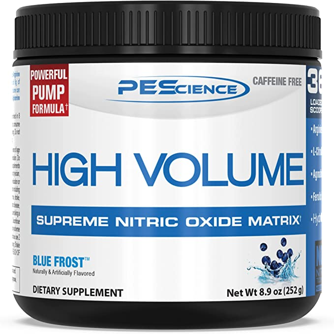
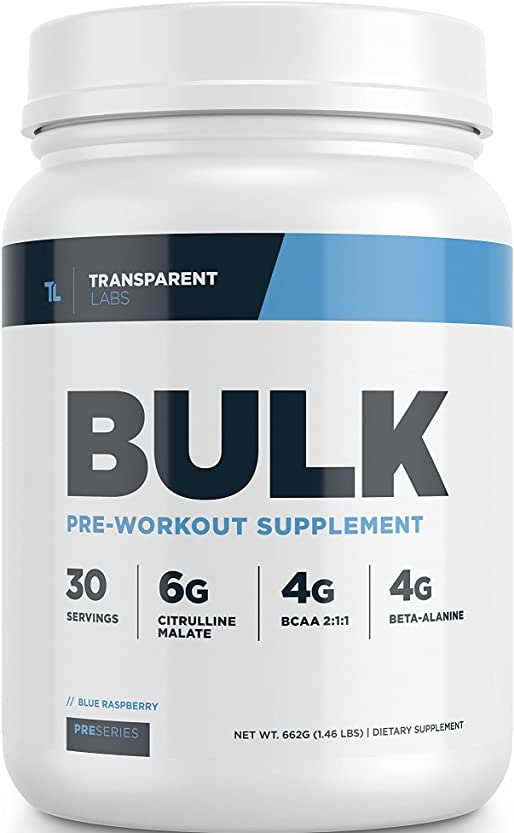
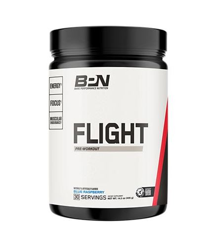
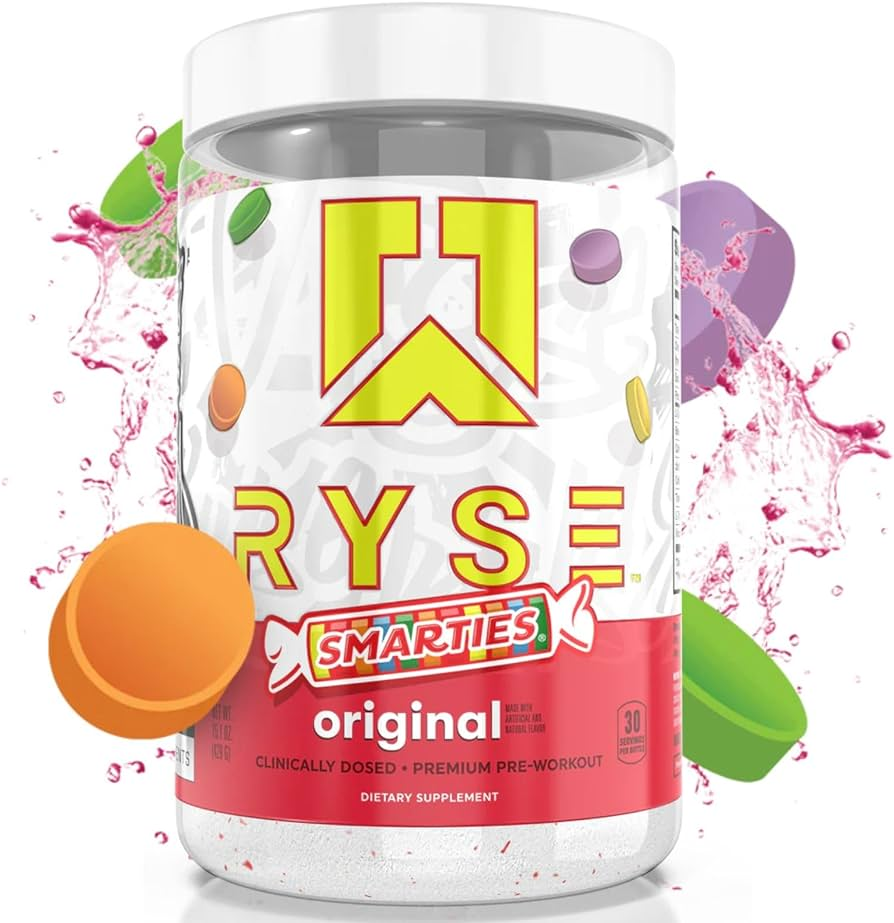

# Pre-Workout Review

## Description

This document is to review pre workouts that I have had.

## Table of Contents

1. [PEScience](#pescience-high-volume-blueberry)
2. [Unbreakable](#unbreakable-performance-pre-workout-cryo-blue)
3. [Transparent Labs Bulk](#transparent-labs-bulk-pre-workout-supplement)
4. [BPN Flight](#bpn-flight)

### PEScience High Volume Blueberry

Rating: 8/10

Obtained this pre-workout off of amazon. It is a non stimulate pre workout. I got this one because I was cutting out Caffiene in my life. It is a pretty good pre-workout but it will not have the push to get you to the gym others do. It does provide a decent pump but only if you are hitting good reps at heavy weight. Not a bad product. Taste is decent in the beginning I think the quality went down the more I bought the product. It does suck being a higher weight you have to take 2 scoops.

### Unbreakable Performance Pre-Workout Cryo Blue

Rating: 6/10

1st pre-workout coming off of non stim pre-workout. Definitely felt the caffiene the first day. Helped motivate me to get to the gym. Did not feel much of a pump on the 1st day I tried it. Taste was pretty good a little caulky. Taking 30 minutes before workouts I feel the tingle around 20 minutes. I did not feel much pump but it does work well as a hypogenic because i sweat a lot more using this pre. Also works the bowls with the caffine the urge to go towards the end of a workout is real.

### Transparent Labs Bulk Pre-Workout Supplement

Rating: 7/10

Originally had this in College but do not remember it enough to give a review so I tried it again. Taste is terrible and super chalky. 1 scoop is 10-12oz oz of water it does say you can do a half scoop for less intensity. 15 minutes in tingles are real and strong. Overall this was a strong pre workout might be a little too intense for some.

### BPN Flight

Rating: 6/10

Has a very solid flavor. The scooper is pretty long which is needed since the container is tall. Water amount went to 8oz-10oz per 1 scoop. normal wait 20-30 min before workout. The tingles are not as intense as others before a workout. Tingles do call for the face rub. Do not really feel it when lifting so it's probably working just not as strong as i need it to be.

### Ryse Smarties

Rating: 6/10

The flavor is nothing like I would imagine. Probably smarties has a hard flavor to match but idk what this taste like to compare to. It has a lot of caffine to the bowel is intense before a workout. Often times had the urge towards the end of a workout again. This is due to the 300mg of caffine. They do claim 100mg is slow release but idk how much truth there is in that. There is some intense focus with this and a good tingle with 3500mg beta alanine. If I go back to ryze I would not do the smarties flavor again but a grape or blue berry might be good.
